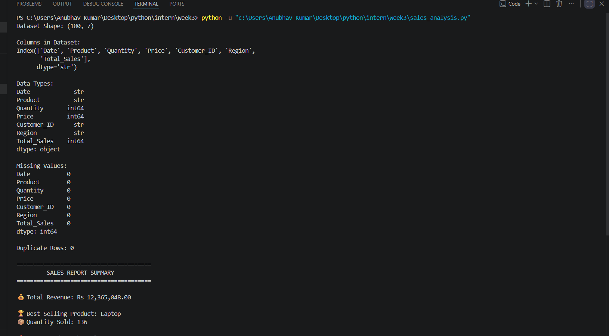
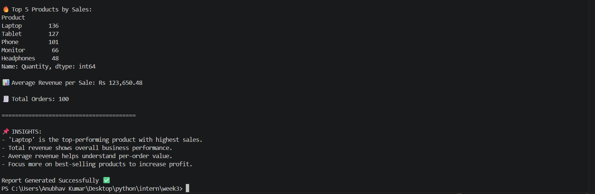

# 📊 Sales Data Analysis Report

## 🧾 Overview

This report presents a comprehensive analysis of the sales dataset using data exploration, cleaning, and analytical techniques. The objective is to extract meaningful insights that can support business decision-making, improve sales strategies, and enhance overall performance.

---

## 🔍 Basic Data Exploration

The initial step involves understanding the structure and nature of the dataset.

* **Dataset Shape:** Determines the number of rows and columns
* **Columns:** Lists all available features
* **Data Types:** Ensures correct data formats

### 📸 Screenshot:

*(Add dataset preview or df.head() output here)*

---

## 🧹 Data Cleaning

Data cleaning ensures accuracy and consistency.

* **Missing Values:** Checked and handled null values
* **Duplicate Rows:** Identified and removed duplicates

### 📸 Screenshot:

*(Add screenshot showing null values or duplicate removal)*

---

## 📈 Data Analysis

### 💰 Total Revenue

**Formula:**
Revenue = Quantity × Price

* **Total Revenue:** `Rs {{total_revenue}}`

### 📸 Screenshot:

*(Add output screenshot of total revenue calculation)*

---

### 🏆 Best-Selling Product

* **Product Name:** `{{top_product_name}}`
* **Quantity Sold:** `{{top_product_quantity}}`

### 📸 Screenshot:

*(Add screenshot of best product output)*

---

### 🔥 Top 5 Products by Quantity Sold

| Rank | Product       | Quantity Sold |
| ---- | ------------- | ------------- |
| 1    | {{Product 1}} | {{Qty}}       |
| 2    | {{Product 2}} | {{Qty}}       |
| 3    | {{Product 3}} | {{Qty}}       |
| 4    | {{Product 4}} | {{Qty}}       |
| 5    | {{Product 5}} | {{Qty}}       |

### 📸 Screenshot:

*(Add screenshot of grouped/sorted data output)*

---

### 📊 Average Revenue per Sale

* **Average Revenue:** `Rs {{avg_revenue}}`

### 📸 Screenshot:

*(Add screenshot of average calculation)*

---

### 🧾 Total Orders

* **Total Orders:** `{{total_orders}}`

### 📸 Screenshot:

*(Add screenshot of total orders output)*

---

## 📌 Key Insights

* 🏆 The best-selling product contributes significantly to sales
* 💰 Total revenue reflects business performance
* 📊 Average revenue shows customer spending behavior
* 📈 Top products drive major sales growth

---

## ⚙️ Technical Approach

* **Tool Used:** Python (Pandas)
* **Methods:**

  * Data Cleaning
  * Feature Engineering
  * Aggregation (`groupby`)
  * Sorting (`sort_values`)

---

## 🧪 Validation & Testing

* Verified calculations manually
* Checked for missing and duplicate data
* Validated aggregation results

### 📸 Screenshot:

*(Add testing/validation output screenshot)*

---

## ✅ Conclusion

The analysis converts raw sales data into actionable insights. It helps in identifying top products, understanding revenue trends, and improving business strategies.

---

📁 *Report Generated Successfully*
